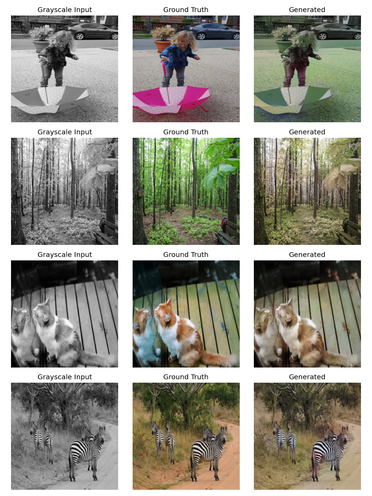

# 🎨 GAN-Based Image Colorization

Automatic colorization of black-and-white photographs using a conditional GAN — a U-Net Generator and PatchGAN Discriminator operating in LAB color space, trained adversarially with L1 and VGG perceptual losses.

**🔗 Live demo:** [https://gan-image-colorization.onrender.com](https://gan-image-colorization.onrender.com)


*Left to right: grayscale input to ground truth to model output (epoch 70, trained on COCO val2017)*

## Highlights

- Conditional GAN architecture (pix2pix-style): U-Net generator with skip connections + PatchGAN discriminator conditioned on the input luminance channel
- LAB color space decomposition -- the network predicts only the 2 chrominance channels (a, b), keeping the luminance (L) channel untouched
- Hybrid loss function: LSGAN adversarial loss + weighted L1 pixel loss + VGG-16 perceptual loss for texture/semantic consistency
- Fully custom, differentiable LAB-RGB conversion in PyTorch (GPU-resident, batched) -- avoids the common CPU-bottleneck mistake of looping per-image through skimage inside the training loop
- Fixed a checkerboard-artifact bug from ConvTranspose2d decoder layers by switching to Upsample+Conv, a known GAN stabilization technique
- Resumable training pipeline (model + optimizer state checkpointing) -- trained across multiple sessions on Google Colab
- Two deployment options included: a custom-designed Flask + HTML/CSS/JS web app (web/), and a Streamlit demo (app.py) for quick iteration

## Architecture
## Tech Stack
Python, PyTorch, torchvision (VGG16 perceptual features), scikit-image (LAB conversion for I/O), Streamlit (deployment), trained on Google Colab (T4 GPU)

## Results

Trained for 70 epochs on a 4,500-image subset of COCO val2017 (90/10 train/val split), 256x256 resolution.

| Stage | Observation |
|---|---|
| Epochs 1-10 | Model converges to a "safe" muted/olive color palette (expected pixel-loss behavior) |
| Epoch 11 | Diagnosed and fixed a checkerboard artifact caused by transposed convolutions |
| Epoch 50 | Adversarial training produces vivid, mostly-accurate color, but speckled noise appears on flat/low-texture regions (skin, walls) |
| Epoch 70 (final) | Enabled VGG perceptual loss -- speckled noise resolved, textures smooth and coherent; some hue inaccuracy remains on visually ambiguous objects |

## Known Limitations

This model was trained on a relatively small subset (4,500 images) of COCO val2017, a general-purpose "everyday scenes" dataset. Its color accuracy is strongest on categories well-represented in that data (people, streets, animals, indoor scenes, foliage) and noticeably weaker on categories that are rarer or visually atypical relative to it -- for example:

- Macro/close-up photography with shallow depth of field (e.g. a single piece of fruit with a blurred background) tends to produce muted, desaturated color rather than vivid, accurate hues. COCO contains relatively few images shot in this style, so the model has weak color priors for it.
- Objects with high real-world color variance (clothing, umbrellas, painted surfaces) sometimes get an incorrect hue entirely, rather than just a desaturated version of the correct one.

This is a genuine, known trade-off in adversarial colorization rather than a deployment bug -- the live demo is functioning correctly; the underlying model's color priors are simply bounded by its training data's diversity. The most direct way to improve this would be training on a larger and more visually diverse dataset (e.g. the full COCO train2017 set, or Places365) for more epochs.

## Project Structure
## Setup & Usage

```bash
git clone https://github.com/Manshvijaiswal/gan-image-colorization.git
cd gan-image-colorization
pip install -r requirements.txt

python train.py
python train.py --resume 50
python inference.py --checkpoint checkpoints/generator_final.pth --input photo.jpg --output result.jpg

python web/server.py
# then open http://localhost:7860

streamlit run app.py
```

Deploying publicly: see DEPLOYMENT.md for step-by-step instructions covering Hugging Face Spaces, Render, and GitHub setup.

## References
- Isola et al., 2017 -- Image-to-Image Translation with Conditional Adversarial Networks (pix2pix)
- Zhang, Isola & Efros, 2016 -- Colorful Image Colorization
- Goodfellow et al., 2014 -- Generative Adversarial Networks
